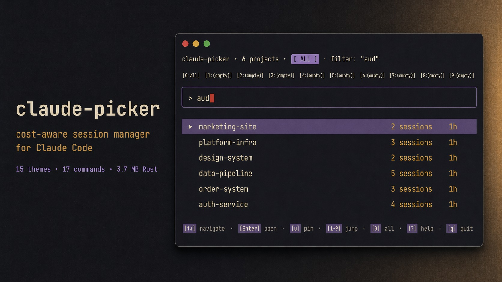

<h1 align="center">claude-picker</h1>

<p align="center">
  <strong>A terminal session manager for Claude Code.</strong><br>
  Fifteen themes. Seventeen commands. One 3.7 MB Rust binary. Zero runtime dependencies.
</p>

<p align="center">
  <a href="https://crates.io/crates/claude-picker"></a>
  <a href="https://github.com/anshul-garg27/claude-picker/releases"></a>
  <a href="https://opensource.org/licenses/MIT"></a>
  
  
  
</p>

<p align="center">
  <a href="#install">Install</a> ·
  <a href="#first-run">First run</a> ·
  <a href="#screens">Screens</a> ·
  <a href="#themes">Themes</a> ·
  <a href="#audit--stats-deep-dive">Audit</a> ·
  <a href="#scripting--shell-integration">Scripting</a> ·
  <a href="#configuration">Config</a> ·
  <a href="#how-it-works">How it works</a>
</p>

<p align="center">
   aud' with an ember cursor, a highlighted first row '▸ marketing-site  2 sessions  1h', five more rows (platform-infra, design-system, data-pipeline, order-system, auth-service) each with their session counts and '1h' timestamps, and a bottom hotkey strip with keycap pills '[↑↓] navigate · [Enter] open · [u] pin · [1-9] jump · [0] all · [?] help · [q] quit'. Full Kanagawa palette — sumi-black background, washi ivory, wisteria purple, autumn gold, ember red." width="92%">
</p>

<p align="center">
  
</p>

---

## The 90-second pitch

Claude Code stores every conversation on disk, but the built-in `/resume` picker is a flat list of UUIDs:

```
? Pick a conversation to resume
  4a2e8f1c-9b3d-4e7a…  (2 hours ago)
  b7c9d2e0-1f4a-8b6c…  (3 hours ago)
  e5f8a3b1-7c2d-9e0f…  (yesterday)
```

No projects. No preview. No names. No cost. No search. No way to find that one session from last Tuesday where you fixed the auth bug.

**claude-picker** reads those same JSONL files and gives you a two-pane picker with live preview, fork tree, word-level diff, file pivot, time-travel replay, an 11-operator filter language, and a cost-optimization audit. On this repo's own session history the audit surfaced $148 of avoidable spend. All reads are local; no telemetry, no network calls.

---

## Install

Four ways. The binary is identical everywhere.

```bash
# 1. Cargo (from crates.io)
cargo install claude-picker

# 2. Cargo from source (this repo)
cargo install --path .

# 3. Homebrew (macOS + Linux)
brew install anshul-garg27/tap/claude-picker

# 4. Shell installer (curl a prebuilt binary from GitHub Releases)
curl -LsSf https://github.com/anshul-garg27/claude-picker/releases/latest/download/claude-picker-installer.sh | sh
```

Prebuilt binaries for every platform live on the [Releases page](https://github.com/anshul-garg27/claude-picker/releases).

**Requirements**
- [Claude Code](https://claude.ai/code) on your `PATH`
- macOS, Linux, or Windows (no runtime deps)
- Rust 1.86+ if building from source — `rust-toolchain.toml` pins the `stable` channel, so `RUSTUP_TOOLCHAIN=stable cargo install --path .` works even if your default toolchain is nightly

---

## First run

```bash
claude-picker
```

Type to fuzzy-filter. `?` pops a context-aware help overlay. `Enter` resumes the highlighted session by exec'ing `claude --resume …`. That's the whole muscle memory — everything else is discoverable from the help key.

---

## Screens

Fourteen screens plus five headless subcommands. Every TUI screen has its own keyboard context and `?` help overlay.

| Screen | Launch | What it shows |
|---|---|---|
| **Picker** (default) | `claude-picker` | Two-pane projects → sessions with live preview, filter ribbon, pinned slots, zebra rows, chain/anomaly badges |
| **Stats** | `stats` / `--stats` | KPI hero cards (tokens, cost, sessions) + burn-rate alert, rank-badged per-project table with model-colored stacked bars, GitHub-style 30-day activity heatmap, project-cost 30-day heatmap, 7×24 day-of-week × hour-of-day heatmap (`p` cycles metric), speed-colored turn-duration histogram with p50/p95/p99 markers, traffic-light budget, optional quota panel (`plan_tier`) |
| **Tree** | `tree` / `--tree` | Session fork tree with jless-style collapsed-node summaries `{3 branches · 127 turns · $4.21}`; `e` / `E` expand / collapse subtree |
| **Diff** | `diff` / `--diff` | Side-by-side session compare with cost delta header; `d` toggles word-level inline diff; `n` / `N` jump between hunks |
| **Search** | `search` / `--search` / `-s` | Full-text plus the 11-operator filter language, with context excerpts around matches |
| **Conversation viewer** | `v` on a session | Full-screen transcript with per-message `HH:MM · +Nm ·` timestamps, interesting-moments mini-timeline, subagent tree, right-edge heatmap gutter (`c` cycles cost / duration / tokens), `z` zen toggle, `Ctrl-e` pipes the current turn to `$EDITOR` |
| **Time-travel replay** | `R` on a session | Timeline scrubber with gap-capping and a 4-position comet trail |
| **Files** | `files` / `--files` | The file-centric pivot. Add `--project NAME` to scope |
| **Hooks** | `hooks` / `--hooks` | Every configured Claude Code hook + execution history |
| **MCP** | `mcp` / `--mcp` | Installed MCP servers + tool-call usage rolled up across sessions |
| **Checkpoints** | `checkpoints` / `--checkpoints` | File-history checkpoints per session |
| **Audit** | `audit` / `--audit` | Cost-optimization report with always-visible 3-heuristic summary band, annual-savings run-rate, per-project cost bars, drill-in per-finding overlay (`--format tui` \| `json` \| `csv`) |
| **AI titles** | `ai-titles` / `--ai-titles` | Batch-name every unnamed session via Haiku 4.5 (cost-gated, cached to `summaries.json`) |
| **Task drawer** | `w` (overlay, any screen) | Background jobs with progress bars; `j` / `k` navigate, `x` cancels the focused task |

### Headless subcommands

| Command | One-line purpose |
|---|---|
| `pipe` | Print selected session ID to stdout (for `claude --resume $(...)` ) |
| `export <sid> [--out PATH] [--redact]` | Export transcript to Markdown; `--redact` masks `sk-ant-…` / `AKIA…` / `ghp_…` / JWTs / `Bearer …` |
| `doctor [--cleanup --yes --format plain\|json\|csv]` | Diagnostic scan of `~/.claude/projects/` — sizes, top sessions, orphan stubs |
| `latest [--project NAME --count N]` | Print the most-recent session id(s) for scripting |
| `prompt [--format PS1\|JSON --no-color]` | Single-line spend summary for embedding in your shell prompt |
| `completions <bash\|zsh\|fish\|elvish\|powershell>` | Emit a shell-completion script |

---

## Themes

Fifteen themes ship in the binary. Cycle live with `t`, list with `--list-themes`. A side-by-side comparison renders at `docs/design/theme-comparison.html` in the workspace root.

| Theme | Mood |
|---|---|
| `kanagawa` *(default)* | Warm ink-wash on dusk blue |
| `finance-terminal` | Bloomberg orange on graphite black, amber tickers |
| `parchment-dark` | Aged-paper cream on chocolate base |
| `paperwhite-warm` | Cream paper with warm ochre accents |
| `catppuccin-mocha` | Purple-forward dark (former default) |
| `catppuccin-latte` | Cream-light sibling of mocha |
| `dracula` | Mid-contrast dark, desaturated |
| `tokyo-night` | Neon indigo on near-black |
| `gruvbox-dark` | Warm retro, boosted greens |
| `nord` | Softer cousin of mocha |
| `nord-aurora` | Cool polar-night with aurora accents |
| `rose-pine-moon` | Warm desaturated, WCAG-readable |
| `high-contrast` | AAA 7:1 ratios everywhere |
| `colorblind-safe` | Blue / orange diff pair — never red-green |
| `terminal-classic` | Retro-CRT phosphor green on black |

**Precedence**: `--theme` flag > `CLAUDE_PICKER_THEME` env > `config.toml` `[ui].theme` > default (`kanagawa`).

```bash
claude-picker --theme tokyo-night         # highest priority
export CLAUDE_PICKER_THEME=nord-aurora    # next
# config.toml: [ui] theme = "parchment-dark"
```

Every theme carries the same 12 semantic tokens (`cost_green/yellow/amber/red/critical`, `speed_fast/medium/slow/glacial`, `model_opus/sonnet/haiku`) so stats render with consistent meaning across palettes. `colorblind-safe` deliberately maps `cost_green = blue` and `cost_red = orange` — no red-green pairs anywhere.

---

## Audit + stats deep-dive

`claude-picker audit` scores every session in `~/.claude/projects/` against three heuristics and produces a run-rate-aware savings estimate. The TUI shows an always-visible 3-heuristic summary band and a drill-in per-finding overlay with per-tool distribution.

<p align="center">
  
</p>

### The three heuristics

- **Tool-ratio** — sessions where `tool_use` tokens dominate the output budget. The ratio is computed as `tool_use / (output + cache-create)`, and anything over 50% is flagged as *"could have been a Haiku call"*.
- **Cache-efficiency** — weak `cache_read` vs `cache_creation` ratio. Sessions that regenerate the same 5-minute ephemeral context repeatedly get flagged; the fix is usually prompt-caching that input.
- **Model-mismatch** — Opus on throwaway work (all-cheap tool calls), or Haiku on heavy reasoning (long free-form plans). Direction-aware so you don't get warned about *"your Opus session should be on Opus"*.

### JSON output (sample from this repo)

```bash
claude-picker audit --format json | jq '.total_savings_usd, .annual_run_rate_usd, (.findings | length)'
```

```json
{
  "total_savings_usd": 148.18,
  "annual_run_rate_usd": 1778.14,
  "findings": [
    {
      "session_id": "1402ab4e-a256-468d-8c66-858c0ddcccb6",
      "project": "architex",
      "session_label": "testing1",
      "total_cost_usd": 1357.81,
      "model_summary": "claude-opus-4-7",
      "kind": "ToolRatio",
      "severity": "warn",
      "message": "71% tool_use tokens — Haiku could save ~$73.00",
      "savings_usd": 72.99
    }
  ]
}
```

### Stats dashboard — project-cost 30-day heatmap

The stats dashboard renders a per-project 30-day heatmap so you can see at a glance which projects eat budget and when.

<p align="center">
  
</p>

Cells are quantile-shaded (p25 / p50 / p75 / p90 over non-zero days). Press `p` on the stats screen to cycle between cost, tokens, and sessions.

---

## Scripting + shell integration

Four headless primitives for shell pipelines.

### `latest` — jump to the most recent session

```bash
$ claude-picker latest --count 3
dc218c2f-b469-40ad-aacd-72aacb18b203
ca0d1766-8eed-4d08-b324-b00e733727a3
f424a1b2-4aef-4bd7-8d8d-f3daa6313a4a

# one-shot resume of the last session in a specific project
claude --resume $(claude-picker latest --project claude-picker)
```

### `prompt` — spend in your PS1

```bash
$ claude-picker prompt
claude: $2343.93 today · $5927.40 month

$ claude-picker prompt --format json
{"today": 2343.93, "month": 5927.40}
```

Add to your shell prompt:

```bash
# bash / zsh
PS1='$(claude-picker prompt --no-color) \$ '

# fish
function fish_prompt
    echo -n (claude-picker prompt --no-color) ' $ '
end
```

### `export --redact` — share a session safely

```bash
claude-picker export 1402ab4e-a256-468d-8c66-858c0ddcccb6 \
  --out ~/Desktop/session.md \
  --redact
```

Writes Markdown with `sk-ant-…` / `AKIA…` / `ghp_…` / JWTs / `Bearer …` masked as `sk-ant-****<last4>` etc.

### `completions` — shell auto-complete

```bash
# zsh
claude-picker completions zsh > ~/.zsh/_claude-picker

# bash
claude-picker completions bash > /usr/local/etc/bash_completion.d/claude-picker

# fish
claude-picker completions fish > ~/.config/fish/completions/claude-picker.fish
```

### Pipe into `claude --resume`

```bash
# interactive pick, then resume
claude --resume $(claude-picker pipe)

# file-pivot: jump to the last session that touched auth.rs
claude --resume $(claude-picker files --project my-api --pipe auth.rs)
```

### `audit --format json` into your tooling

```bash
claude-picker audit --format json | jq '.findings | group_by(.project) | map({project: .[0].project, savings: map(.savings_usd) | add})'
claude-picker audit --format csv > audit.csv
```

---

## Configuration

Everything lives under `~/.config/claude-picker/`. Generate a starter with `claude-picker --generate-config`.

| File | Purpose |
|---|---|
| `config.toml` | `[ui]` / `[picker]` / `[actions]` / `[keys]` / `[bookmarks]` preferences |
| `bookmarks.json` | Pinned session IDs |
| `summaries.json` | Cached AI summaries keyed by session ID |
| `file-index.json` | `--files` pivot index |
| `budget.toml` | Monthly budget for the stats forecast |
| `pinned.toml` | `u`-pinned project slots (1–9) |

### Full `config.toml` example

```toml
[ui]
# Theme name — one of `--list-themes` output. Default: "kanagawa".
theme = "kanagawa"

# Disable every animation (fork reveal, pulse HUD, replay comet trail,
# peek fade, cursor glide, toast slide). Respects screen-reader and
# accessibility preferences. Default: false.
reduce_motion = false

# Alternating row shades on tabular lists. Default: true on dark themes.
zebra_rows = true

# Subscription tier for the stats quota panel. One of:
#   "none" (panel hidden, default), "pro" ($20), "max" ($100),
#   "max20" ($200), "team" ($30/user), "enterprise" (no cap).
plan_tier = "none"

# Auto-redact secret shapes (sk-ant-…, AKIA…, ghp_…, JWTs, Bearer …) in
# preview + viewer. Flip off if you're debugging a token yourself.
redact_preview = true

# Stats column cap. 0 = use full terminal width.
stats_width = 0

# Custom date format (strftime). Empty = auto.
date_format = ""

[picker]
# One of: "recent", "cost", "msgs", "name", "bookmarked-first".
sort = "bookmarked-first"
include_hidden_projects = true
min_messages = 2          # sessions below this are hidden
model_filter = ""         # "", "opus", "sonnet", "haiku"

[actions]
# Flags forwarded to `claude --resume`. Env CLAUDE_PICKER_FLAGS wins if set.
claude_flags = "--dangerously-skip-permissions"

# Editor override for `o`. Empty = $EDITOR → code → cursor → nvim → vim.
editor = ""

[bookmarks]
# Session IDs that should always float to the top.
ids = []
```

### Accurate cost tracking

Current Anthropic rates:

| Model | Input ($/MTok) | Output ($/MTok) |
|---|---|---|
| Opus 4.x | $5 | $25 |
| Sonnet 4.x | $3 | $15 |
| Haiku 4.5 | $1 | $5 |
| Opus 3 (legacy) | $15 | $75 |

Cache pricing: `write_5m = 1.25×` input, `write_1h = 2×` input, `read = 0.1×` input. Tokens come from every `message.usage` block, including `cache_creation.ephemeral_5m_input_tokens`, `cache_creation.ephemeral_1h_input_tokens`, and `cache_read_input_tokens`.

### Claude flags

By default, claude-picker launches `claude` with `--dangerously-skip-permissions`. Override via env:

```bash
export CLAUDE_PICKER_FLAGS=""                  # vanilla permissions
export CLAUDE_PICKER_FLAGS="--model sonnet"    # force sonnet
```

### Global CLI flags

| Flag | Purpose |
|---|---|
| `--theme NAME` | Theme for this run |
| `--list-themes` | Print all themes and exit |
| `--generate-config` | Write a default `config.toml` |
| `--config-file PATH` | Use a non-default config path |
| `--preview-cmd CMD` | Override the preview pane (supports `{sid}` / `{cwd}`) |
| `--project NAME` | Scope `files` and a few others to one project |
| `--force` | Skip cost-gated confirmations (AI batch jobs) |

---

## UI polish

Everything below respects `[ui] reduce_motion = true`.

- **Loading skeletons** — cold start shows pulsing grey placeholder rows for ~1.2s while session enumeration settles, instead of snapping from empty to full.
- **Cursor memory** — re-enter a project and the cursor lands where you left it, not at the top.
- **Smooth scroll** — scroll interpolates over a few frames instead of jumping a page.
- **Chain badge (⛓)** — session list surfaces sessions that appear to continue each other: same project, opened within 24h, similar titles.
- **Cost anomaly badge (⚡)** — sessions whose cost is ≥2× the project median get a lightning chip so you spot runaway runs without opening the audit.
- **Zebra rows** — tabular lists alternate `base` and `surface0` on dark themes. Auto-off on light themes.
- **Interesting-moments timeline** in the conversation viewer — a compact top strip marks cost spikes, tool bursts, long pauses, and the first+last user prompts.
- **Subagent tree** — Task tool calls render as nested children with `├─` / `└─` / `│ ` connectors, so multi-agent runs read as a tree instead of a flat log.

---

## Privacy

- **Nothing leaves your machine** except two explicit opt-in AI features:
  - `Ctrl+A` — AI summarize the highlighted session via Claude Haiku 4.5 (cached to `summaries.json`).
  - `ai-titles` — batch-name unnamed sessions via Haiku 4.5 (prompts for confirmation, runs cost-gated).
- **No telemetry.** No analytics. No background sync. No phone-home on startup.
- **Auto-redact in preview** — known secret shapes are masked before rendering. `sk-ant-…`, `sk-proj-…`, `AKIA…`, `ASIA…`, `ghp_…`, `gho_…`, `ghu_…`, `ghs_…`, `eyJ….….…` JWTs, `Bearer …` headers all get replaced with `****<last4>`. Opt out via `[ui] redact_preview = false`.
- **Export with `--redact`** — transcripts you share go through the same secret-masking pass before they hit disk.

---

## How it works

Claude Code stores sessions in `~/.claude/projects/` as JSONL files. Each project directory is lossy-encoded (`/Users/you/my_project` → `-Users-you-my-project`). Per-session metadata lives in `~/.claude/sessions/`.

claude-picker reads these directly to:

1. **Discover projects** — scans encoded directories, resolves real paths via a three-layer decoder (session-metadata lookup → JSONL `cwd` scan → naive decode fallback)
2. **Extract session info** — names from `custom-title` entries, message counts, permission modes, subagent counts, last user prompt
3. **Compute cost** — parses `message.usage` including cache-creation and cache-read fields against the pricing table above
4. **Detect forks and chains** — follows `forkedFrom` to build parent/child trees; heuristically detects cross-session chains by project + recency + title similarity
5. **Index files** — walks tool-use events to build the reverse `file → sessions` map
6. **Filter noise** — skips SDK-entrypoint sessions and strips system messages from previews
7. **Redact secrets** — runs every preview and export through a shape-based secret masker
8. **Render** — `ratatui` + `crossterm` with 24-bit color, unicode-correct rendering, `nucleo` fuzzy (~6× faster than skim), LCS word-diff, clipboard via `arboard`, Kitty/iTerm2/halfblock identicon thumbnails, `tachyonfx` animations (all respecting `reduce_motion`)

Pure Rust, no daemon, ~3.7 MB release binary.

---

## Project stats

- **93** Rust source files · **53 k** LOC
- **714** unit tests passing (0.07s via `cargo test --release --lib`)
- **~3.7 MB** release binary (stripped)
- **Rust 1.86+** MSRV · edition 2021

### Tech stack

- `ratatui` + `crossterm` — TUI engine
- `nucleo` — fuzzy matcher (~6× faster than `skim`)
- `catppuccin` — palette source for the Catppuccin pair
- `tachyonfx` — shader-style animations (fork reveal, comet trail, peek fade, pulse HUD) — all gated by `reduce_motion`
- `image` — pure-Rust pixel buffer for identicon thumbnails (halfblock rendering, works in every terminal)
- `clap` (derive) + `clap_complete` — CLI parsing + completions emitter
- `serde` + `serde_json` — JSONL parsing
- `unicode-width` + `unicode-segmentation` — grapheme-safe rendering for CJK and emoji
- `arboard` — cross-platform clipboard
- `similar` — LCS diff (word + line)
- `regex` — secret-redaction patterns
- `toml`, `chrono`, `anyhow`, `thiserror` — utilities

---

## Contributing

Open an issue or PR — contributions welcome.

```bash
RUSTUP_TOOLCHAIN=stable cargo test --release --lib
RUSTUP_TOOLCHAIN=stable cargo build --release --bin claude-picker
```

See [CHANGELOG.md](CHANGELOG.md) for the release history. See [BREW-TAP.md](BREW-TAP.md) for Homebrew tap maintenance.

---

## Gallery

**Session picker** — filter, cost chips, model/permission pills, timestamps, live preview

<p align="center">
  
</p>

**Cost audit** — 3-heuristic summary band, annual run-rate, per-project bar

<p align="center">
  
</p>

**Stats dashboard** — KPI cards, 7×24 heatmap, project 30-day cost, budget, by-model

<p align="center">
  
</p>

**Shell-prompt integration** — single-line spend summary

<p align="center">
  
</p>

```bash
$ claude-picker prompt
claude: $458.38 today · $1,257.84 month
```

---

## License

MIT. See [LICENSE](LICENSE).

<p align="center">
  Built by <a href="https://github.com/anshul-garg27">Anshul Garg</a>.
</p>
